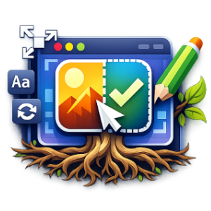

<div align="center">



# RootMe

**An Electron + React app instance manager for Windows.**

[](https://www.electronjs.org/)
[](https://react.dev/)
[](https://www.typescriptlang.org/)
[](https://vite.dev/)
[](https://tailwindcss.com/)
[](https://github.com/pmndrs/zustand)
[](https://lucide.dev/)
[](https://www.electron.build/)

</div>

Search for running processes by name or window title, then manage each matching instance: toggle its visibility, focus it, move/resize its window, or rename its title and icon. Save any instance as a preset to reposition and relaunch its window layout later.

## Features

- **Verify** — search running processes by image name or window title (backed by `tasklist`), with recent searches remembered for quick re-lookup.
- **Focus** — restore and bring a window to the foreground.
- **Show/Minimize** — toggle a window's visibility, or send it to the tray.
- **Move/Resize** — read and update a window's position and size.
- **Edit** — rename a window's title and replace its icon live, via direct Win32 calls (`SetWindowText`, `WM_SETICON`).
- **Presets** — organize saved windows into named groups. Drag a search result into a group (or onto an existing preset to bind its PID) to capture its title, icon, and bounds; focus a single preset or a whole group at once; export/import groups as JSON.

Window edits (title, icon, position, size, visibility) apply only to the live running window for the current session and don't survive the target app restarting. Presets, recent searches, and the theme choice are saved locally in the app's storage and persist across restarts.

> Windows only. Window management relies on `tasklist` and Win32 APIs invoked through PowerShell.

## Tech stack

- [Electron](https://www.electronjs.org/) + [electron-vite](https://electron-vite.org/) for the desktop shell and build tooling
- [React 19](https://react.dev/) + [Tailwind CSS](https://tailwindcss.com/) for the renderer UI
- [Zustand](https://github.com/pmndrs/zustand) for state management
- [lucide-react](https://lucide.dev/) for icons
- [electron-builder](https://www.electron.build/) for packaging

## Getting started

```bash
npm install
npm run dev
```

## Scripts

| Script              | Description                              |
| -------------------- | ----------------------------------------- |
| `npm run dev`        | Start the app in development mode         |
| `npm run build`       | Type-check and build the app for production |
| `npm run preview`     | Preview the production build              |
| `npm run build:win`   | Build and package a Windows installer/portable exe |
| `npm run build:dir`   | Build an unpacked Windows app directory (for testing) |
| `npm run typecheck`   | Type-check both the main and renderer processes |

## Project structure

```
src/
  main/            Electron main process (window management, process listing)
  preload/         Context bridge exposing the IPC API to the renderer
ui/
  src/
    components/    Shared UI components (icon button, drag ghost)
    features/
      commons/     App shell (header, theme toggle)
      home/        Search, results list, and presets panel
    store/         Zustand stores (app instances, presets)
    constants/     Storage keys and shared UI/drag constants
    types/         Renderer-side type declarations
```
